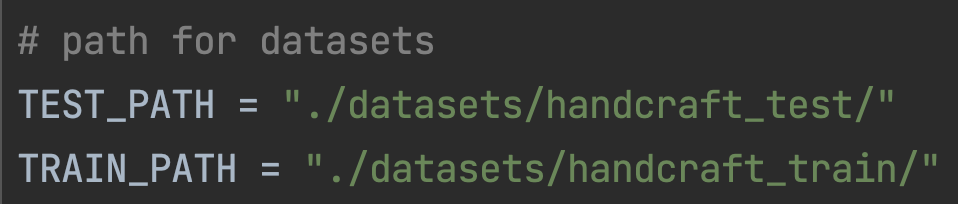
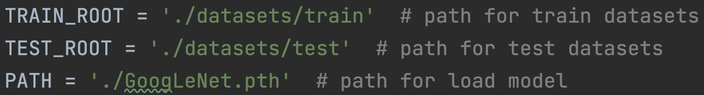

# Facial Recognition Mini Project
# Group: Positive Mental Attitude
## Members<br>
| ชื่อ | นามสกุล | รหัสนักศึกษา |
| --- | --- | --- |
|เดชพนต์| นุ่นเสน| 62070070|
|ณัฐวัตน์| สามสี| 62070067|
|ธีรภัทร |บุญช่วยแล้ว| 62070096|
|ชวิน |โลห์รัตนเสน่ห์ |62070045|
## Preparations
### Install Dependency
```
conda install --file requirements.txt
```
### Pretrained Model
<strong>[Handcraft Base Model](https://drive.google.com/file/d/127xDnKjgnsZlmpXgaeqtuatYAunfnDyv/view?usp=sharing)</strong>
<strong>[Learning Base Model](https://drive.google.com/file/d/1Jf-eA_XX8v3wWNptgLSTQBfs_F1Ru6gE/view?usp=sharing)</strong>

## Project 2 Handcraft Base
### How to Run
```
python3 handcraft_based.py
```

 - train - เรียกใช้ผ่านฟังก์ชั่น ```train()```
 - test - เรียกใช้ผ่านฟังก์ชั่น ```test()```
### เปลี่ยน Datasets

สามารเปลี่ยนได้โดยการ แก้ค่าของตัวแปร TEST_PATH และ TRAIN_PATH

## Project 3 Learning Base
### How to Run
```
python3 learning_based.py
```
 - train - เรียกใช้ผ่านฟังก์ชั่น ```main(​"train")```
 - test - เรียกใช้ผ่านฟังก์ชั่น ```main("test")```
### เปลี่ยน Datasets

สามารเปลี่ยนได้โดยการ แก้ค่าของตัวแปร TEST_ROOT และ TRAIN_ROOT
